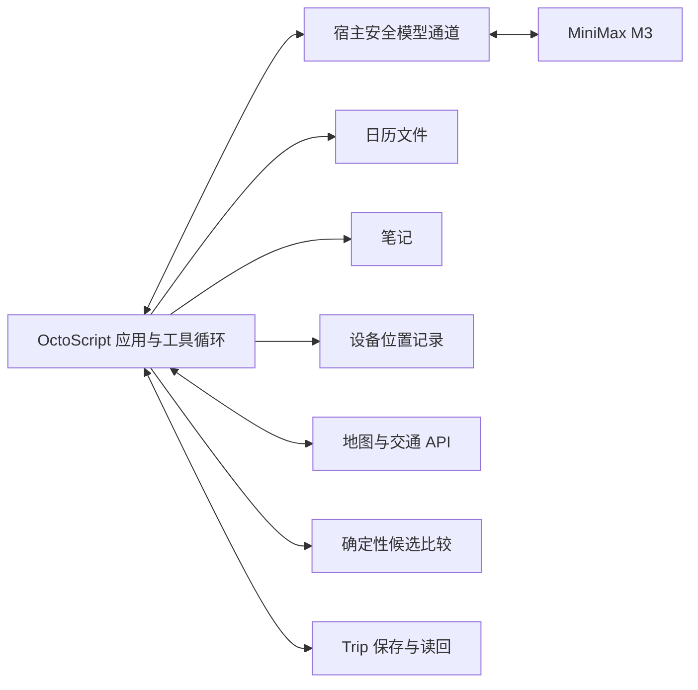

# Navigation 架构草案

状态：2026-10-01 技术草案。首轮在深圳交付使用 MiniMax M3 的 OctoScript Navigation 应用，并直接接入服务。用户目前要求继续方案和计划；路线求解、多源上下文读取、服务连接及运行时 Agent 均未实现。实施阶段与验收建议归[当前任务](../tasks/capability-boundary/packet.md)。

## 职责

1. OctoScript／Makepad 应用承载任务入口、背景来源、路线卡片、确认和 Trip 状态，复用官方宿主的脚本运行、授权与已可用服务。地图呈现与导航交接复用地图服务；当前本地约束草稿只用于开发调试。
2. MiniMax M3 结合自然语言和已授权背景形成约束、选择下一步工具并解释结果；应用执行经校验的操作、回传观察并维护有步数和时间上限的任务循环。模型不得自行编造路径、费用、时刻或执行结果。优先核对现成模型通道能否支持这一循环；octos 是可选的运行时集成路径，octoscode／OctoLoop 的开发记录不代替应用任务证据。
3. 确定性规划器输入约束与有时间戳的交通数据，输出可行候选和约束检查结果。没有可行路线时返回不可行原因，不静默放宽时间上限。
4. 应用的 Navigation 工具分别读取日历、笔记、位置等来源，查询地图／交通 API，保存来源与查询时间，并调用确定性规划器。先采用具体脚本函数，不预设每个工具都需要原生 host service。首选核实高德 Web 服务是否覆盖深圳的公共交通、步行、驾车和出租车估价；缺失字段保持未知。具体服务、凭据通道、坐标与费用口径以实际验证为准。
5. Trip 状态机记录 proposal → confirmed → active → completed/cancelled；来源变化或过期产生 needs_replan，替代计划需要新的确认。未来宿主能力以实际运行验证为准。

## 能力层的待设计边界

能力层需要补充出行相关的数据与操作，而不是要求用户手动把其它应用中的内容搬进草稿。跨应用上下文负责取得已授权的信息并保留来源、时间和适用范围；偏好学习负责把用户明确设置与从选择中推断的偏好区分开。两者是职责说明，不预先要求拆成独立服务或引入通用用户画像框架。

首轮直接实现并验证必要工具。运行时按需生成工具、手机应用操作与长期偏好学习保留为后续方向；不要求这些机制先成立才能完成机场任务。直接服务接入已获允许，但不因此同时接入天气、提醒、多个日历及多个打车平台。

航班时间、行李或本次天气是具体任务背景，不自动变成长期偏好。如何表达推断的可信程度、过期条件和用户修正，是下一轮设计需要解决的问题。信息缺失或来源冲突影响到达期限、预算等关键约束时，应澄清而不是用猜测掩盖。

第一条完整任务需要能证明：用户少输入仍可形成正确约束，系统取得的数据有来源和授权，求解结果满足约束，并在上下文被纠正后重新计算。演示必须保留背景在不同来源中的分布，不事先制作包含全部答案的行程背景文件。

| 来源 | 首轮模拟方式与作用 |
| --- | --- |
| 日历 | 独立的 `.ics` 文件保留事件标识、日期、时区、标题和地点，用于判断本次出行对应哪个事件；保留合理的无关事件，避免默认取第一项。 |
| 笔记 | 独立 Markdown 笔记保留机票记录、机场／航站楼或出行备注及更新时间。按事件关联查找，区分有效记录、过期信息和无法消解的冲突。 |
| 设备位置 | 独立位置记录提供坐标、采样时间和模拟来源；演示定位与实际 GPS 明确区分。币种结合报价及地域上下文推断，不在位置记录里预填整个任务结论。 |

各来源独立查询并返回原始记录或必要摘录、记录标识与时间。格式解析可以确定性处理，任务相关性和跨来源关联在运行时完成；生成的约束保留证据引用。来源中的文本是待理解的数据，不能扩展工具权限。更换某一来源或制造有效记录冲突后，约束或澄清行为应相应变化。这些文件用于模拟真实数据源，不表示在线日历、笔记账户或定位服务已经接通。

## 路线模型

- 地点节点要包含换乘/上车/下车位置；经纬度与搜索显示名不能互相替代。
- 路段记录 mode、起终点、出发/到达时刻、等待、距离、费用、步行量、数据来源与过期时间。
- 搜索状态除了节点和时间，还可能需要票制状态、当前乘坐服务和打车段状态。简单把每条边价格相加，会重复收取出租车起步价或遗漏公共交通优惠。
- 打车费用按一次连续打车行程计费；接入实时估价前只能显示明确标注的 fixture/估算，不能宣称真实报价。
- 第一模式是在到达截止前最小化总费用；最快、疲劳偏好、最晚出发在基础模型验证后扩展。“最慢”含义仍待决定。
- 支持费用、耗时、疲劳、换乘、可靠性的非支配候选。支配剪枝只有在时间相关性和票制状态可比时才成立。
- 金额用最小货币单位整数；时刻用含时区的绝对时间；费用估价区间与未知票价不能冒充精确值。草稿界面的分钟预算仅用于初始化，后续迁移为 departure_at / arrive_by。
- 机场演示的时间上限从收到指令时起计算，查询和确认消耗的时间也计入。有限候选和估价只能支持“已核实候选中的最低估价”，不声称全局最优或保证实际费用与到达时间。
- 首轮优先使用服务给出的完整候选；不足以覆盖混合方式时，从已查公共交通路线中选少量换乘点，分别查询公共交通接打车与打车接公共交通，包含步行衔接。使用各次连续乘车的完整票价／估价，不把原全程价格直接分摊到路段；打车行驶时间与候车假设分开标注，查询时段需与实际接续时间匹配。

## 第一条完整任务建议

从有来源的行程、位置及偏好形成约束，只澄清关键缺失信息 → Agent 调用真实交通工具 → 确定性比较全公共交通、全打车和混合候选 → 在官方宿主内展示方案、来源及限制 → 用户确认 → 写入 Trip → 读回完整路线与确认状态。

首轮以确认行程并读回为必需终点。导航交接只有在对应路线或分段交接实际验证后才展示为已完成；一个地图链接不能证明任意混合方案已经开始导航。持续路况监测与重规划在此基础上扩展。可复现 fixture 用于约束、计费、过期和失败边界检查，与在线交通验证分别记录。

## 宿主集成

初赛交付按用户补充收敛为 OctoScript 应用。先复用官方现成宿主，不以新增 Rust 服务、修改 ROM 或接齐所有官方项目作为前置。本仓库已验证的仍是 App Hub card-host，本轮没有升级或编译新宿主；该版本不提供模型 host service。

拟议调用关系如下，尚未实测：

优先验证较新官方宿主已有的 `model.complete`：它接收 task、input、schema 等参数，返回校验后的 JSON，没有原生 tools／tool_calls 或消息历史透传。可尝试让 M3 返回有限动作集合中的下一步，由 OctoScript 校验参数、调用工具，再把观察传入下一轮；这需要应用实际实现循环，不能把一次调用当作完整 Agent。接口使用 fast／strong 分类而非应用指定模型名，因此必须通过隔离宿主配置与请求证据确认实际调用 `MiniMax-M3`，不能静默换成其他模型。

若采用支持原生 Function Call 的现成通道，需按 MiniMax 协议保留完整的模型消息和工具结果。已有 octos 应用 peer 与 host-service 工具执行器保留为另一条候选路径；只有实测证明现成脚本路径有必需能力缺口后，才评估是否需要这条路径或最小宿主改动。接口和固定源码证据归[资料核对](sources.md)。

本地 `.env` 保存开发配置，隔离脚本已用它验证 M3 原生 Function Call 往返与高德 API；OctoScript 和正式启动流程尚未接入。模型和地图凭据由宿主或服务端管理，不写入应用包或日志；后续需要验证从本机配置到宿主实际请求的通道。服务侧预检不证明上述应用循环已成立。
