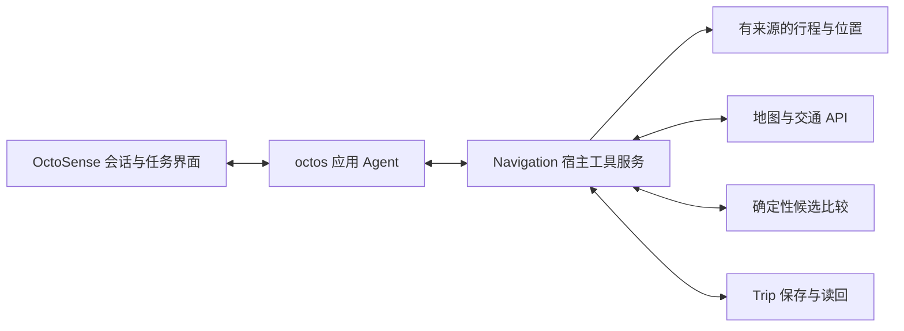

# Navigation 架构草案

状态：2026-10-01 技术草案。首轮在深圳使用比赛官方工具链搭建 Navigation Agent，并直接接入服务。用户目前要求继续方案和计划；路线求解、上下文读取、服务连接及运行时 Agent 均未实现。实施阶段与验收建议归[当前任务](../tasks/capability-boundary/packet.md)。

## 职责

1. 官方 OctoSense 宿主承载 Agent 会话、授权与任务入口，OctoScript／Makepad 呈现背景来源、路线卡片、确认和 Trip 状态。地图呈现与导航交接复用地图服务；当前本地约束草稿只用于开发调试。
2. octos 运行时中的 Navigation Agent 结合自然语言和已授权背景形成约束，调用上下文、交通与任务工具，并解释工具结果；不得自行编造路径、费用、时刻或执行结果。octoscode／OctoLoop 用于开发协作与审查，其开发记录不代替运行时 Agent 证据。
3. 确定性规划器输入约束与有时间戳的交通数据，输出可行候选和约束检查结果。没有可行路线时返回不可行原因，不静默放宽时间上限。
4. Navigation 工具服务读取行程上下文，直接查询地图／交通 API，保存来源与查询时间，并调用确定性规划器。首选核实高德 Web 服务是否覆盖深圳的公共交通、步行、驾车和出租车估价；缺失字段保持未知。具体服务、权限、坐标与费用口径以真实响应验证，不根据接口名称推定完整可用。
5. Trip 状态机记录 proposal → confirmed → active → completed/cancelled；来源变化或过期产生 needs_replan，替代计划需要新的确认。未来宿主能力以实际运行验证为准。

## 能力层的待设计边界

能力层需要补充出行相关的数据与操作，而不是要求用户手动把其它应用中的内容搬进草稿。跨应用上下文负责取得已授权的信息并保留来源、时间和适用范围；偏好学习负责把用户明确设置与从选择中推断的偏好区分开。两者是职责说明，不预先要求拆成独立服务或引入通用用户画像框架。

首轮直接实现并验证必要工具。运行时按需生成工具、手机应用操作与长期偏好学习保留为后续方向；不要求这些机制先成立才能完成机场任务。直接服务接入已获允许，但不因此同时接入天气、提醒、多个日历及多个打车平台。

航班时间、行李或本次天气是具体任务背景，不自动变成长期偏好。如何表达推断的可信程度、过期条件和用户修正，是下一轮设计需要解决的问题。信息缺失或来源冲突影响到达期限、预算等关键约束时，应澄清而不是用猜测掩盖。

第一条完整任务需要能证明：用户少输入仍可形成正确约束，系统取得的数据有来源和授权，求解结果满足约束，并在上下文被纠正后重新计算。可先读取明确标注的演示行程文件，验证工具在运行时获取背景；这不等于已接入在线日历。位置同样区分实际定位与带来源的演示起点，不能用固定位置冒充实时 GPS。

## 路线模型

- 地点节点要包含换乘/上车/下车位置；经纬度与搜索显示名不能互相替代。
- 路段记录 mode、起终点、出发/到达时刻、等待、距离、费用、步行量、数据来源与过期时间。
- 搜索状态除了节点和时间，还可能需要票制状态、当前乘坐服务和打车段状态。简单把每条边价格相加，会重复收取出租车起步价或遗漏公共交通优惠。
- 打车费用按一次连续打车行程计费；接入实时估价前只能显示明确标注的 fixture/估算，不能宣称真实报价。
- 第一模式是在到达截止前最小化总费用；最快、疲劳偏好、最晚出发在基础模型验证后扩展。“最慢”含义仍待决定。
- 支持费用、耗时、疲劳、换乘、可靠性的非支配候选。支配剪枝只有在时间相关性和票制状态可比时才成立。
- 金额用最小货币单位整数；时刻用含时区的绝对时间；费用估价区间与未知票价不能冒充精确值。草稿界面的分钟预算仅用于初始化，后续迁移为 departure_at / arrive_by。
- 机场演示的时间上限从收到指令时起计算，查询和确认消耗的时间也计入。有限候选和估价只能支持“已核实候选中的最低估价”，不声称全局最优或保证实际费用与到达时间。
- 首轮优先使用服务给出的完整候选；不足以覆盖混合方式时，从已查公共交通路线中选少量换乘点，分别查询公共交通接打车与打车接公共交通，包含步行衔接。使用各次连续乘车的完整票价／估价，不把原全程价格直接分摊到路段；打车行驶时间与候车假设分开标注，查询时段需与实际接续时间匹配。

## 第一条完整任务建议

从有来源的行程、位置及偏好形成约束，只澄清关键缺失信息 → Agent 调用真实交通工具 → 确定性比较全公共交通、全打车和混合候选 → 在官方宿主内展示方案、来源及限制 → 用户确认 → 写入 Trip → 读回完整路线与确认状态。

首轮以确认行程并读回为必需终点。导航交接只有在对应路线或分段交接实际验证后才展示为已完成；一个地图链接不能证明任意混合方案已经开始导航。持续路况监测与重规划在此基础上扩展。可复现 fixture 用于约束、计费、过期和失败边界检查，与在线交通验证分别记录。

## 宿主集成

本仓库已验证的仍是 App Hub card-host，本轮没有升级或编译新宿主。调查到较新的官方 OctoSense 源码已具备应用 peer、host-service 工具声明加载与结果回传；优先沿这条官方路径做实验，具体固定版本和源码入口见[资料核对](sources.md)。

拟议调用关系如下，尚未实测：

先以官方已有只读工具验证真实模型调用与结果回传，再接本项目工具。服务注册、能力准入、工具声明与执行器必须同时成立，不能只写 tools.json；一次性 model.complete 不等于工具循环。模型和地图凭据由宿主或服务端管理，不进入 bundle。当前 card-host 仍无 host services，新宿主源码能力不等于已在本仓库可用。
