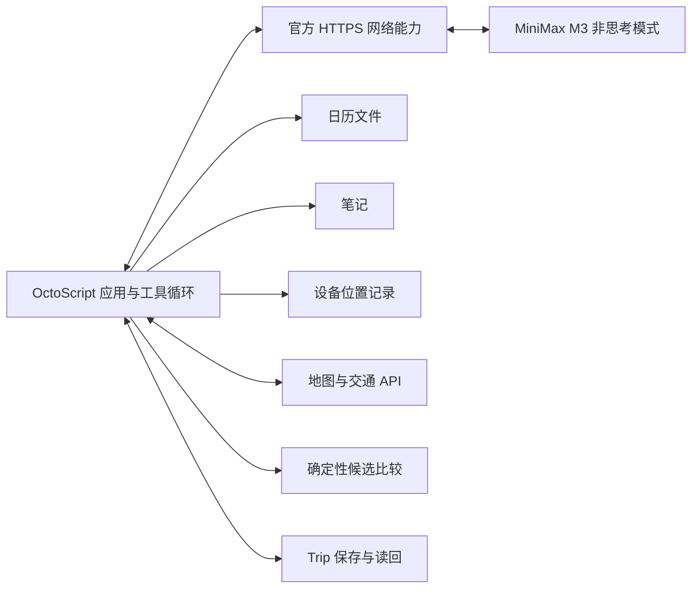

# Navigation 架构草案

状态：2026-10-03，深圳是首轮演示数据，应用不限定该城市；初赛交付使用 MiniMax M3 的 OctoScript Navigation 应用，并直接接入服务。M3 多源关联、在线地点／交通查询、确定性选择、Trip 确认读回与 stock 重启已通过真实公共交通任务。另一次相同指令、不同模拟位置的真实任务确认了打车接地铁的完整混合候选；全程打车价格仍未知，不能宣称全部路线类型已在线验收。当前职责与后续提议按下文区分，完成依据归[当前任务](../tasks/capability-boundary/packet.md)。

## 职责

1. OctoScript／Makepad 应用承载文本输入、查询／终止和必要结果，复用官方宿主的脚本运行、授权与已可用服务。候选按纯文本逐条说明，输入明确“确认”后保存结果；地图呈现与导航交接尚未验证。
2. MiniMax M3 结合自然语言和已授权背景形成约束、选择下一步工具并解释结果；应用执行经校验的操作、回传观察并维护有步数和时间上限的任务循环。模型不得自行编造路径、费用、时刻或执行结果。优先核对现成模型通道能否支持这一循环；octos 是可选的运行时集成路径，octoscode／OctoLoop 的开发记录不代替应用任务证据。
3. 确定性规划器输入约束与有时间戳的交通数据，输出可行候选和约束检查结果。没有可行路线时返回不可行原因，不静默放宽时间上限。
4. 应用的 Navigation 工具分别读取日历、笔记、位置等来源，查询地图／交通 API，保存来源与查询时间，并调用确定性规划器。先采用具体脚本函数，不预设每个工具都需要原生 host service。首选核实高德 Web 服务是否覆盖深圳的公共交通、步行、驾车和出租车估价；缺失字段保持未知。具体服务、凭据通道、坐标与费用口径以实际验证为准。
5. 首轮 Trip 只记录已确认方案并读回；确认前来源变化、定位过期或路线失效会阻止确认。active、completed、持续观测与重新规划是后续方向，保存成功不表示已经开始导航。

## 能力层的待设计边界

能力层需要补充出行相关的数据与操作，而不是要求用户手动把其它应用中的内容搬进草稿。跨应用上下文负责取得已授权的信息并保留来源、时间和适用范围；偏好学习负责把用户明确设置与从选择中推断的偏好区分开。两者是职责说明，不预先要求拆成独立服务或引入通用用户画像框架。

首轮直接实现并验证必要工具。运行时按需生成工具、手机应用操作与长期偏好学习保留为后续方向；不要求这些机制先成立才能完成机场任务。直接服务接入已获允许，但不因此同时接入天气、提醒、多个日历及多个打车平台。

航班时间、行李或本次天气是具体任务背景，不自动变成长期偏好。当前没有真实日历／笔记账户；live 模式的模拟文件不能作为用户实际目的地的证据。缺少可靠行程时，M3 根据真实位置和实际机场 POI 提出目的地假设，结果说明依据、未读取真实机票以及未知航站楼。用户可以纠正；真正无法由查询解决的关键缺口仍需澄清。

第一条完整任务需要能证明：用户少输入仍可形成正确约束，系统取得的数据有来源和授权，求解结果满足约束，并在上下文被纠正后重新计算。演示必须保留背景在不同来源中的分布，不事先制作包含全部答案的行程背景文件。

| 来源 | 首轮模拟方式与作用 |
| --- | --- |
| 日历 | 独立的 `.ics` 文件保留事件标识、日期、时区、标题和地点，用于判断本次出行对应哪个事件；保留合理的无关事件，避免默认取第一项。 |
| 笔记 | 独立 Markdown 笔记保留机票记录、机场／航站楼或出行备注及更新时间。按事件关联查找，区分有效记录、过期信息和无法消解的冲突。 |
| 设备位置 | 默认通过宿主一次性读取真实位置；显式演示模式读取独立模拟记录。两者均保留坐标、采样时间与来源。币种结合报价及地域上下文推断，不在位置记录里预填整个任务结论。 |

各来源独立查询并返回原始记录或必要摘录、记录标识与时间。格式解析可以确定性处理，任务相关性和跨来源关联在运行时完成；生成的约束保留证据引用。来源中的文本是待理解的数据，不能扩展工具权限。更换某一来源或制造有效记录冲突后，约束或澄清行为应相应变化。日历与笔记文件用于模拟真实数据源，不表示在线账户已经接通。设备位置另经获授权的宿主读取。

机场发现使用高德飞机场类别 `150104`，当前城市仅作查询偏好，允许跨城返回。执行器只接受本次实际返回的合格 POI，保留类型、父子关系、时间、城市和到达点；不让模型生成坐标。POI 类别与入口字段不保证商业客运运营或具体航站楼适用，不能凭空补 T3、国内出发或真实机票。显式 demo 的关联行程路径仍校验原文引用；其中已明确的出发场景由执行器形成完整查询，不要求模型重复每个词。

## 路线模型

- 地点节点要包含换乘/上车/下车位置；经纬度与搜索显示名不能互相替代。
- 路段记录 mode、起终点、出发/到达时刻、等待、距离、费用、步行量、数据来源与过期时间。
- 搜索状态除了节点和时间，还可能需要票制状态、当前乘坐服务和打车段状态。简单把每条边价格相加，会重复收取出租车起步价或遗漏公共交通优惠。
- 打车费用按一次连续打车行程计费；接入实时估价前只能显示明确标注的 fixture/估算，不能宣称真实报价。
- 第一模式是在到达截止前最小化总费用；最快、疲劳偏好、最晚出发在基础模型验证后扩展。“最慢”含义仍待决定。
- 支持费用、耗时、疲劳、换乘、可靠性的非支配候选。支配剪枝只有在时间相关性和票制状态可比时才成立。
- 金额用最小货币单位整数；时刻用含时区的绝对时间；费用估价区间与未知票价不能冒充精确值。应用将用户给出的分钟数转成固定的 arrive_by，并在展示与确认时使用当前时间重检。
- 机场演示的时间上限从收到指令时起计算，查询和确认消耗的时间也计入。有限候选和估价只能支持“已核实候选中的最低估价”，不声称全局最优或保证实际费用与到达时间。
- 当前复用高德返回的完整公共交通与混合候选，允许当前起终点可直接调用的官方策略，包括最经济模式；每种策略只查询一次，由 Agent 自主选择。地铁图模式需要双方地铁站 POI ID，当前未取得时明确拒绝派发，不猜 ID。不自行拼接未经查询的路段。供应商没有返回满足条件的混合方案时明确保留缺口。后续如实现接续查询，应使用各次连续乘车的完整票价／估价并核对步行、候车和实际接续时段，不能按距离分摊原全程价格。

## 首轮任务与后续边界

从有来源的行程、位置及偏好形成约束，只澄清关键缺失信息 → Agent 调用真实交通工具 → 确定性比较全公共交通、全打车和混合候选 → 在官方宿主内展示方案、来源及限制 → 用户确认 → 写入 Trip → 读回完整路线与确认状态。

首轮以确认行程并读回为必需终点。导航交接只有在对应路线或分段交接实际验证后才展示为已完成；一个地图链接不能证明任意混合方案已经开始导航。持续路况监测与重规划在此基础上扩展。可复现 fixture 用于约束、计费、过期和失败边界检查，与在线交通验证分别记录。

## 宿主集成

初赛交付按用户补充收敛为 OctoScript 应用。此前模型与路线验证复用 stock 官方宿主；用户已另行批准补齐 macOS 实时定位服务，使用独立锁定的本地 Rust 补丁，不修改 ROM。原 App Hub card-host 用于快速隔离检查；正式模型通道已在独立锁定的 OctoSense desktop `app-hub` 组合中通过实测。启动、隔离数据与每次源码变动后的增量构建归[工具链说明](../toolchain/README.md)。

应用职责关系如下；具体成功与失败证据归任务包，组件通路成功不等于整条出行任务完成：

正式应用通过官方 `net.http_request` 调用 MiniMax-M3 的非思考模式。应用让模型选择有限工具动作，校验模型身份、单个函数调用与参数，执行工具并将有来源的观察及执行器维护的工具状态传入下一轮。状态说明来源性质、当前可用动作、约束与目的地、已查公交策略、驾车及展示条件；schema 说明输入契约。system prompt 只保留任务目标、来源边界和调用协议，不规定读源顺序、公交策略顺序或价格／端点算法。

循环采用直接 callback，以任务标识忽略迟到结果，并限制步数、单次请求、响应大小和每段自动规划时间。身份正确但输出方式或调用数量不符时，最多一次反馈重问，被拒绝的动作不执行；错模型、网络失败与业务约束失败不会自动放宽。用户等待澄清或纠正仍消耗原始到达期限。结果阶段的补充文字开启新的有界计算，更新位置和候选，但保留首次收到指令的时间、预算与截止；只有完整的新分钟数及预算才开始新行程。

此前已实测 `model.complete` 的两轮工具探针及完整八轮规划；但该版本不透传 thinking 参数，重复真实任务在约 60 秒后收到 host_error。首轮不为此修改 Rust，改用现成网络能力。该接口与版本证据归[资料核对](sources.md)，旧探针不能替代当前通道的完整验收。

启动器从 `.env` 生成隔离宿主 profile 与本应用的私有运行配置，目录 0700、凭据文件 0600。受信任的应用在运行时读取高德与 M3 key，模型 key 仅在 Authorization header 中使用；不复制进 bundle、模型输入、UI、Trip 或日志。当前模型地址固定为已验证的国内平台 `https://api.minimax.cn/v1`，不自动切换模型或提供方。网络工具固定允许的 HTTPS 主机与路径，并捕获同步派发拒绝及异步错误，不把含 key 的 URL、原始错误或私有配置回传给模型。权限隔离其他系统账号，不隔离同账号下的所有程序；这不是通用凭据代理。

## 实时位置读取

已接入：应用以 `location` capability 请求一次性 `location.get`，宿主只处理有权限、可提示的前台应用请求，使用 CoreLocation 的原始 WGS84 样本。单次最多 15 秒，样本年龄最多 60 秒、精度半径最多 100 米；成功、取消、关闭、失败或超时停止本次采集。定位拒绝、不可用、精度不足、过期与后台调用分别返回明确状态，不用读取时间伪造采样时间，不自动回退模拟位置。

应用保留原始坐标、系统采样秒数与精度，再调用高德坐标转换取得 GCJ-02，并以逆地理编码取得实际起点城市。目的地城市从选中 POI 独立核实，公交请求分别使用两端城市编码，允许跨城；缺失元数据不能从起点或演示数据回填。定位转换完成与 Trip 确认时仍核对原始样本时效；过期须重新规划，不能换起点后确认旧路线。系统精度半径与供应商路径端点 25 米校验是不同指标，后者不能证明用户实际处于某个米级位置。默认真实位置与显式 demo 模式分别标注；日历与笔记目前仍模拟来源。编译与真实系统样本、权限弹窗和失败返回已实测；多城市分支的检查及完整任务证据归任务包。

应用不因城市、超过一天的时限、较大预算或远期日程拒绝任务。金额用整数分，数值及期限乘加须能由 f64 精确表示；这些是计算边界。未指定币种的预算须结合已核实地域与供应商人民币计价推断并展示依据，显式外币预算没有换算能力时澄清，不改写金额。高德当前大陆计价依据不代表所有城市、时段或跨城路线都能返回完整候选。定位时效、精度、交通时效与端点核验属于数据质量策略；请求次数、执行时间和主机白名单属于资源与权限边界，仍保留。
